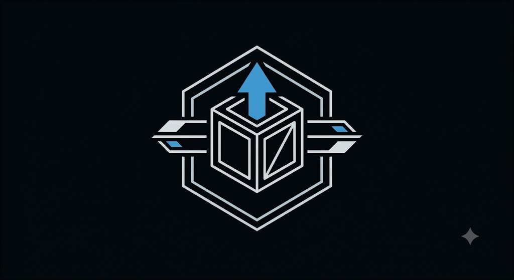

# SCHT — Star Citizen Hauling Tracker



SCHT is a local Windows companion for Star Citizen hauling contracts. It reads your `Game.log`, organizes accepted contracts, tracks cargo and payouts, and provides a loading checklist with an optional compact overlay.

> **Public test release:** SCHT 1.6.0. Please report unexpected behavior after removing personal information from screenshots and log excerpts.

## Download

### Recommended: Windows installer

[**Download SCHT-Setup-1.6.0.exe**](https://github.com/eugenesvv/SCHT/releases/latest/download/SCHT-Setup-1.6.0.exe)

The installer adds SCHT for the current Windows user, creates a Start Menu shortcut, offers an optional desktop shortcut, and provides normal Windows uninstallation. Administrator access is normally not required.

### Portable version

[Download SCHT.exe](https://github.com/eugenesvv/SCHT/releases/latest/download/SCHT.exe)

The portable build runs without installation. Deleting it does not remove SCHT settings or session data stored in AppData.

[View release notes and checksums](https://github.com/eugenesvv/SCHT/releases/latest)

## What's new in 1.6.0

- Adds a capacity-aware Route Planner with an offline Star Citizen location catalog, custom start/final stops, personal waypoints, and editable route order
- Adds a compact Route Overlay with live pickup, drop-off, waypoint, cargo, and remaining-distance guidance
- Sorts the Logistics Overlay around the active route and refreshes both logistics views with denser, consistent cards and controls
- Adds saved route workspaces, session-safe recovery, and reliable invalidation when contract inputs genuinely change
- Refreshes the illustrated offline Manual and improves automatic OCR route recovery and first-contract persistence

## System requirements

- 64-bit Windows 10 or Windows 11
- Microsoft Edge WebView2 Runtime, normally included with current Windows installations
- Star Citizen in Borderless or Windowed mode when using the overlay

Python is not required. Both downloads include everything SCHT needs to run.

## Quick start

1. Install and open SCHT.
2. Select your Star Citizen `Game.log` if SCHT does not find it automatically. A typical location is:

   ```text
   C:\Program Files\Roberts Space Industries\StarCitizen\LIVE\Game.log
   ```

3. Choose **Scan Log** to load existing hauling activity.
4. Choose **Start Watch** before accepting new hauling contracts.
5. Use the **Logistics Board** for cargo preparation, or open **Route Planner** to optimize your stops and launch its compact in-game overlay.

SCHT never modifies `Game.log` or your in-game contracts.

## What SCHT provides

- Accepted, completed, and abandoned hauling-contract tracking
- Session time, payouts, profit, and hourly-rate summaries
- Cargo grouped by pickup and drop-off location
- Capacity-aware route optimization with custom endpoints and waypoints
- Loading checklist shared between the dashboard and overlay
- Compact, resizable, always-on-top logistics and route overlays
- CSV and HTML manifest exports
- OCR-assisted recovery for contract details omitted from `Game.log`
- Manual contract review and corrections tied to the exact mission

## Local data and privacy

SCHT works locally and does not require an account or cloud service. Application data is stored under:

```text
%LOCALAPPDATA%\SCHT\
```

This includes settings, window positions, checklist state, session information, and saved contract corrections. Screenshot OCR is performed through Windows components on the local computer.

Before sharing diagnostics, remove player names, account identifiers, personal file paths, unrelated desktop content, and any other private information.

## Troubleshooting

### Windows warns about an unrecognized app

Public test builds may be unsigned, so Microsoft Defender SmartScreen can display a warning. Verify that the file came from this repository's Releases page and compare its SHA-256 checksum with `SHA256SUMS.txt` before deciding whether to run it.

### SCHT opens without a usable window

Install or repair the [Microsoft Edge WebView2 Runtime](https://developer.microsoft.com/microsoft-edge/webview2/) and reopen SCHT.

### No contracts appear

- Confirm the selected file is the active `LIVE\Game.log`.
- Choose **Scan Log**.
- Start live watching before accepting another hauling contract.
- Remember that Star Citizen log formats can change between game versions.

### The overlay does not appear above the game

Use Star Citizen in Borderless or Windowed mode. Windows cannot guarantee a normal topmost overlay above exclusive fullscreen applications.

## Uninstall

Open **Installed apps** in Windows Settings, select **SCHT**, and choose **Uninstall**. The SCHT installer removes the application, its shortcuts, current SCHT AppData, and the legacy SC Hauling Log Tracker AppData folder. It does not remove Microsoft Edge WebView2 because WebView2 is shared by other applications.

## Feedback and contributions

Use [GitHub Issues](https://github.com/eugenesvv/SCHT/issues) for sanitized bug reports and feature requests.

This `main` branch is the end-user release landing page. Source code, tests, packaging, and contributor documentation are maintained on the [`dev` branch](https://github.com/eugenesvv/SCHT/tree/dev). Developers should read the [contribution guide](https://github.com/eugenesvv/SCHT/blob/dev/CONTRIBUTING.md) before submitting changes.

## Disclaimer

SCHT is an unofficial community tool and is not affiliated with or endorsed by Cloud Imperium Games or Roberts Space Industries. Star Citizen and related names are trademarks of their respective owners.
